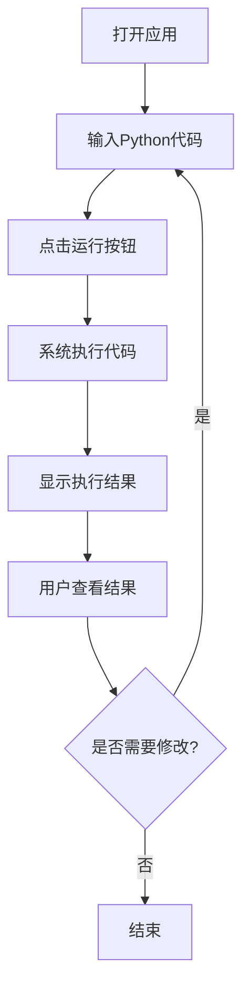

## 1. Product Overview
Python代码运行环境是一个在线工具，支持实时执行Python代码，为用户提供便捷的代码编辑和运行体验。
- 主要功能包括代码编辑、语法高亮、Python执行、结果展示，解决用户快速测试和运行Python代码的需求
- 目标用户为学生、教师、开发者等需要快速验证Python代码的人群

## 2. Core Features

### 2.1 User Roles
| 角色 | 注册方式 | 核心权限 |
|------|--------|----------|
| 普通用户 | 无需注册 | 可使用所有代码编辑和运行功能 |

### 2.2 Feature Module
1. **代码编辑区**：代码编辑器、语法高亮、自动缩进
2. **执行控制区**：运行按钮、停止按钮、执行状态
3. **结果展示区**：代码执行结果、错误信息、数据可视化

### 2.3 Page Details
| 页面名称 | 模块名称 | 功能描述 |
|---------|---------|----------|
| 主页面 | 代码编辑区 | 提供Python代码编辑功能，支持语法高亮和自动缩进 |
| 主页面 | 执行控制区 | 提供代码运行和停止按钮，显示执行状态 |
| 主页面 | 结果展示区 | 展示代码执行结果，包括标准输出、错误信息和数据可视化 |

## 3. Core Process
用户打开应用 → 输入Python代码 → 点击运行按钮 → 系统执行代码 → 显示执行结果 → 用户查看结果并进行修改 → 重复执行过程

## 4. User Interface Design
### 4.1 Design Style
- 主色调：深蓝色 (#1E40AF) 和浅灰色 (#F3F4F6)
- 强调色：绿色 (#10B981) 用于成功状态，红色 (#EF4444) 用于错误状态
- 按钮样式：圆角矩形，有轻微的阴影效果
- 字体：主标题使用 Inter 字体，代码使用等宽字体 (Fira Code)
- 布局风格：分栏式布局，左侧代码编辑区，右侧结果展示区
- 图标风格：简洁现代的线性图标

### 4.2 Page Design Overview
| 页面名称 | 模块名称 | UI元素 |
|---------|---------|--------|
| 主页面 | 代码编辑区 | 深色背景 (#1E293B)，浅色代码文本 (#E2E8F0)，语法高亮，行号显示 |
| 主页面 | 执行控制区 | 绿色运行按钮，红色停止按钮，执行状态指示器 |
| 主页面 | 结果展示区 | 白色背景，黑色文本，错误信息红色显示，数据可视化图表 |

### 4.3 Responsiveness
- 桌面端优先设计，支持响应式布局
- 在平板和手机上，代码编辑区和结果展示区会垂直排列
- 支持触摸操作，按钮尺寸适合触摸

### 4.4 3D Scene Guidance
- 不适用，本项目为2D界面应用