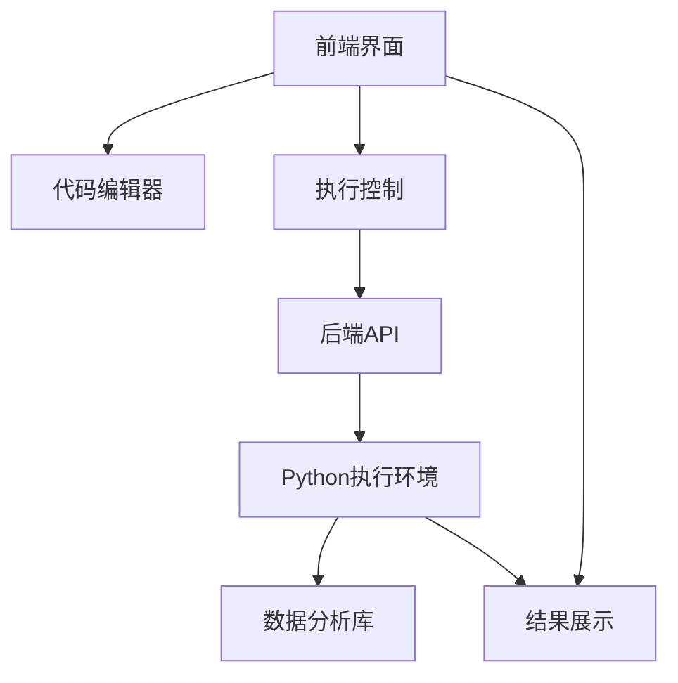
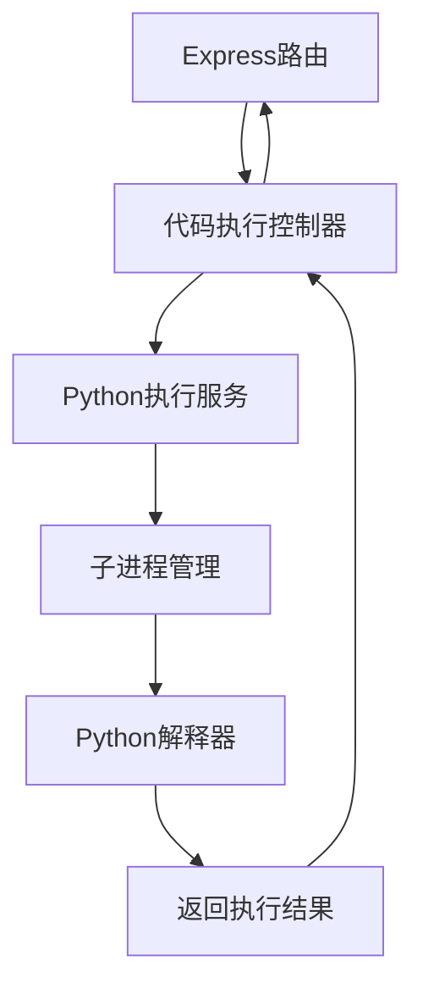

## 1. Architecture Design


## 2. Technology Description
- 前端：React@18 + TypeScript + Tailwind CSS + Vite
- 后端：Express@4 + Node.js
- 代码编辑器：Monaco Editor (VS Code的编辑器内核)
- Python执行：使用Node.js的child_process模块调用系统Python
- 数据分析库：支持NumPy、Pandas、Matplotlib等
- 数据可视化：Chart.js

## 3. Route Definitions
| 路由 | 用途 |
|------|------|
| / | 主页面，包含代码编辑器和结果展示 |
| /api/run | 执行Python代码的API端点 |

## 4. API Definitions
### 4.1 执行Python代码
- **请求方式**：POST
- **路径**：/api/run
- **请求体**：
  ```json
  {
    "code": "print('Hello, World!')"
  }
  ```
- **响应**：
  ```json
  {
    "success": true,
    "output": "Hello, World!\n",
    "error": ""
  }
  ```

## 5. Server Architecture Diagram


## 6. Data Model
### 6.1 数据模型定义
- 本项目不需要数据库存储，所有数据都是临时的

### 6.2 数据定义语言
- 不适用，本项目不需要数据库